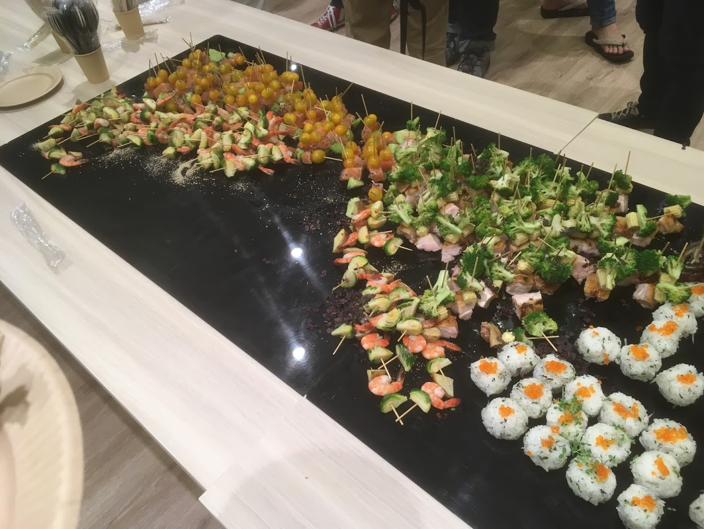

# Markdownのカオスと付き合う

### すかいゆき / 藤原 由来 (sky_y)

#### 姫路IT系勉強会 2017年9月16日

---

# 自己紹介
-  すかいゆき / 藤原 由来（ふじわら ゆき）
    -  [Twitter: sky_y](https://twitter.com/sky_y)
-  フリープログラマ
-  日本Pandocユーザ会 代表
-  某専門学校 非常勤講師
-  Markdown本を書こうとしている
---

# 本題の前に
---

# Write the Doc Kobeの件
-  ドキュメンテーションの勉強会（の企画）
-  姫路IT系勉強会 2017.03
    -  [HackMD](https://hackmd.io/s/Hypo7Eqje) を参照
-  結局どうなった→ポシャりました
    -  良い会場が見つからない、マネジメントに失敗、キャパオーバー
-  このネタだけでも1枠ほしかったけど割愛
---

# Markdownの話をしよう

---

# 発端：ワテさんのツイート

      <blockquote class="twitter-tweet" data-lang="ja">
“技術ドキュメンテーションのためのreStructuredTextとMarkdownを比較する | プログラミング | POSTD” <a href="https://t.co/SzJYtYWYNN">https://t.co/SzJYtYWYNN</a>
&mdash; ワテ (@aWebprogrammer) <a href="https://twitter.com/aWebprogrammer/status/905782577025343490">2017年9月7日</a></blockquote>

---

# 表現に制約が多くてキツい
      <blockquote class="twitter-tweet" data-lang="ja">
Markdownでは表現に制約が多すぎてキツいときは確かにある
&mdash; ワテ (@aWebprogrammer) <a href="https://twitter.com/aWebprogrammer/status/905782797389799424">2017年9月7日</a></blockquote>

---

# 方言が多くてキツい
      <blockquote class="twitter-tweet" data-lang="ja">
あと、Markdownは方言が多くてキツい時もある、基本的にはGFMで書こうとすると、素のMarkdownしか対応していないエディタではフェンスコードブロックが使えねぇ・・ってなって、泣きそうになる
&mdash; ワテ (@aWebprogrammer) <a href="https://twitter.com/aWebprogrammer/status/905783463776706560">2017年9月7日</a></blockquote>

---

# Q: 根本的な解決はあるのか？
---

# A: ない
---

# Markdownは器用貧乏
      <blockquote class="twitter-tweet" data-lang="ja">
ちなみに僕の持論としては「Markdownはどの用途にも書けるけど、どの用途でもベストになれない」と思っています。「器用貧乏」とか「帯に短しタスキに長し」のような運命を背負ってしまった記法だと個人的には思ってます…<a href="https://t.co/ijYWmFi9vG">https://t.co/ijYWmFi9vG</a>
&mdash; すかいゆき / 藤原惟 (@sky_y) <a href="https://twitter.com/sky_y/status/905829011284099072">2017年9月7日</a></blockquote>

---

# Markdownよりも「良い」軽量マークアップ言語・処理系は山ほどある
-  例えば
    -  reStructuredText (Sphinx)
    -  AsciiDoc
    -  Re:View (出版向け)
    -  無数のオレオレ記法

---

# Q: マークアップ言語が「良い」とは、どういうことか？
-  ヒント1：表現力が高いマークアップ言語は、たいてい流行らない？
    -  [SGML](https://ja.wikipedia.org/wiki/Standard_Generalized_Markup_Language) vs HTML
-  ヒント2：なぜWindowsは、世界中からクソと言われつつも使われているのか？

---

# Markdownに多くを期待しない
-  「必要なときに、必要な形式で取り出せる」ことが重要
    -  Pandocに対応したフォーマットなら、Pandocで他のMarkdown方言に変換する手がある
        -  Pandoc's Markdown, reStructuredText, Emacs Org, MediaWiki..
    -  Markdownが良い点
        -  どんな方言であっても、（標準的な書き方を守れば）方言間で書き換えをするときのコストが小さく済む
            -  マイナーな方言で覚えたり書き溜めたりするとちょっと大変
    -  Markdownがいまいちな点
        -  機械可読という観点で、書式があまり信用できない

---

# Markdown仕様をたくさん覚えない
-  「無難なMarkdown記法」だけ覚える
    -  おすすめ: CommonMark or GitHub Flavored Markdown (GFM)
    -  CommonMark: [Learn Markdown in 60 Seconds](http://commonmark.org/help/)
    -  GFM: [GitHub Flavored Markdown Spec](https://github.github.com/gfm/)
        -  現在のGFM Specは、CommonMarkのスーパーセット

---

# 個人的におすすめのワークフロー
-  CommonMarkかGFMで下書き（マスタードキュメント）を書く（7～9割ぐらい）
-  出力先のエディタや処理系にコピペする
-  プレビューとチートシートを見ながら書式を修正する

---

# [Pandoc](http://pandoc.org/)のススメ
-  入力可能なマークアップ言語（一部）
    -  Markdown (Pandoc独自, CommonMark, その他方言4つ)
    -  reStructuredText, textile, HTML, LaTeX, MediaWiki markup, OPML, Emacs Org-Mode
-  出力フォーマット：たくさん
-  ぶっちゃけ、HTMLにエクスポートできる処理系なら、どんなマークアップ言語でもHTML経由でPandocにぶち込める
    -  ただしHTMLが構造的でないほどカオスになる
    -  いい感じにパースしてくれるとは限らないけど、手修正を前提とするなら悪くない選択肢

---

# Markdown Night 参加しました
-  [Markdown Night 2017 Summer - connpass](https://connpass.com/event/63383/)
-  資料
    -  [資料一覧 - connpass](https://connpass.com/event/63383/presentation/)
    -  おすすめ: gfxさん [Markdownはなぜ拡張され続けるのか](https://bitjourney.kibe.la/shared/entries/f740d533-0d57-44fe-a891-dfe669d16121)
-  発表スライド
    -  Markdown処理系を実装する辛さに関する話題が多数
    -  通称 `@__gfx__` 問題
        -  babelmark III で表示してみる
    -  自分のLT: [Markdownの本を一緒に作りたい](https://gitpitch.com/sky-y/markdown-night-2017summer)

---

# メルカリ飯

---

# 質問ある？